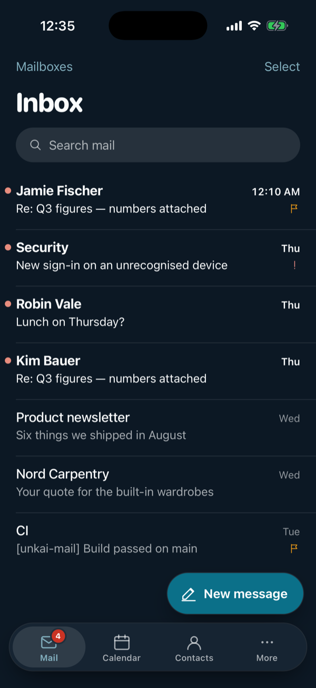
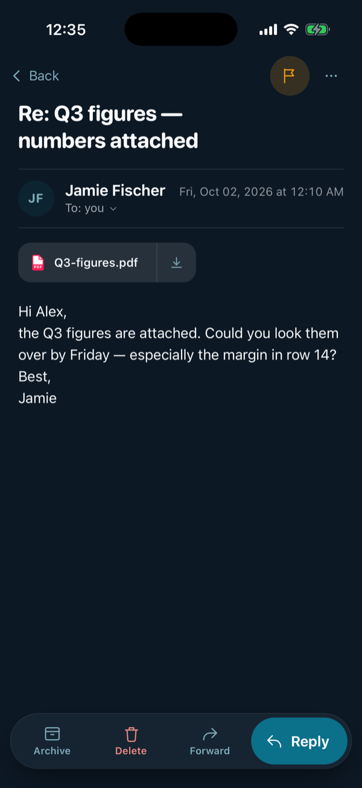
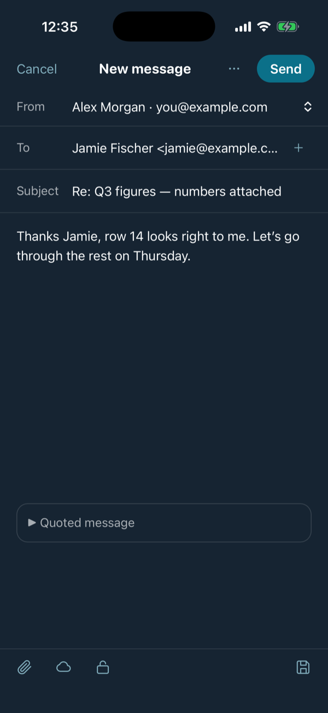
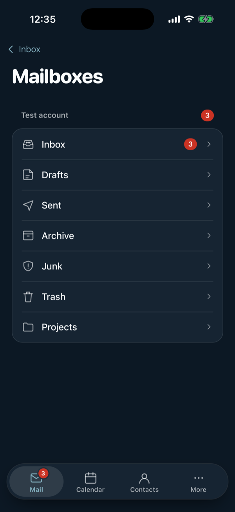
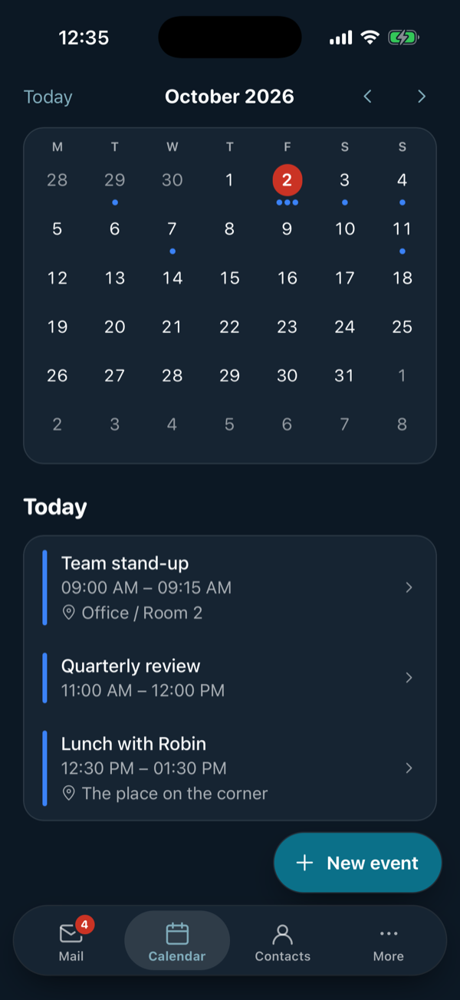
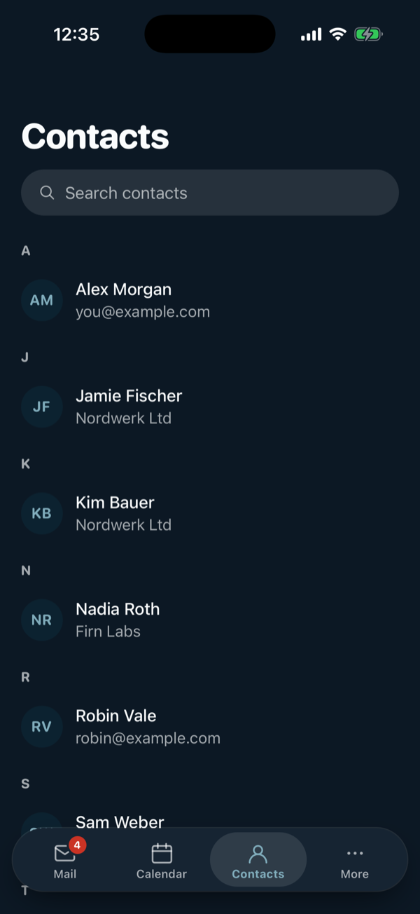

<div align="center">


# Unkai Mail — Mobile

**The Unkai mail client on iOS: same Rust core, same Nextcloud integration, a UI built for one hand.**

[](LICENSE)
[](https://www.rust-lang.org/)
[](https://tauri.app)
[](https://svelte.dev)

</div>

> ⚠️ **Project status — the app is feature-complete for a first version,
> but there is no download yet.** Unkai Mail is not on the App Store or
> TestFlight, and no `.ipa` is published. **If you want to try it, you
> have to build it yourself** on a Mac with Xcode — see
> [Try it yourself](#try-it-yourself). The simulator needs no Apple
> account, and the built-in **test mode** needs no mail account.
>
> The mail path works end to end and has been exercised against a live
> IMAP/SMTP server: setup with certificate trust, folders, reading, swipe
> triage, archive, sending (verified on the server), search. The
> **Nextcloud** surfaces — Files, Talk, Notes, Tasks, Calendar, Contacts,
> Shares — have never talked to a real server, and neither has the app to
> a commercial mail provider. Treat every build as a development build,
> not as a daily driver. Bugs and questions go to the
> [issue tracker](https://github.com/firn-labs/unkai-mail-mobile/issues).

---

## What it is

A port of the [Unkai Mail desktop
client](https://github.com/firn-labs/unkai-mail) to iOS (Android next).

The whole point of the port is that most of the app didn't need
porting: `crates/` — IMAP, SMTP, JMAP, CalDAV, CardDAV, the Nextcloud
API, the SQLCipher store, OpenPGP/S-MIME, and the entire
transport-agnostic application layer — compiles for iOS **unchanged**.
What was rewritten is everything that assumed a desktop:

- **The Tauri shell** (`src-tauri/`) — about 220 command shims and one app context, instead of a tray, menus, a multi-window profile registry, an updater and a deep-link router.
- **The frontend** (`ui/`) — a mobile app with up to five tabs, per-tab navigation stacks, swipe triage, bottom sheets and safe-area-aware chrome, instead of a three-pane desktop layout.

[`CLAUDE.md`](CLAUDE.md) carries the full ledger of what was dropped and why.

---

## Screenshots

Taken in the iOS simulator in dark mode with the built-in test mode's
sample data — no real account, no server.

<p align="center">
  
  
  
</p>
<p align="center">
  
  
  
</p>

The current design ("Wolkenmeer") and its rationale are documented in
[`docs/design/`](docs/design/), with before/after screenshots.

---

## Features

### 📬 Mail

- **Opens on the inbox** — one account's inbox, or a unified inbox once there are several, with an **account switch** under the title.
- **Special-use folders** detected via RFC 6154 attributes with a name fallback, so Sent/Drafts/Trash land in the right place on any server, and are named in your language.
- **Offline-first**: every list and message paints from the encrypted local cache before the network is touched; actions in the reader update the list immediately while the server catches up.
- **Swipe triage** — swipe left to archive or delete, swipe right to flip read state, full-swipe to commit, long-press for everything else. Destructive actions apply immediately instead of asking first.
- **Multi-select** for bulk archive / delete / mark-read.
- **Conversation grouping**, threading anchors on replies (`In-Reply-To` / `References`), flags, pins, priorities.
- **Search** across the local index instantly, with an explicit "search on the server" escape hatch for older mail (IMAP SEARCH).
- **Outbox** — messages that couldn't be sent wait there with the reason, and can be retried or dropped.
- **Reader hardening**: DOMPurify sanitising, remote images blocked until you allow them (per message or per sender), `cid:` inline images fetched in one round-trip, quoted history folded away, desktop-width layouts capped to the screen.
- **Dark reading mode** — HTML mail on white paper as its sender laid it out, or re-coloured for a dark theme with contrast repair for colours that would vanish.

### ☁️ Nextcloud and other clouds

- **Files** — browse, open, save to the Files app, and create share links.
- **Attach a link, not a file** — pick a file from your Nextcloud in the composer and the recipient gets a share link from *your* server.
- **Talk** — see your rooms, create a public one, drop its join link into an email, or jump into the call.
- **Notes** — read and write, Markdown source with a preview toggle.
- **Tasks** — every list in one prioritised view, due dates, priorities, complete/reopen.
- **Calendar** — month grid with the selected day's agenda, event editing, attendees, reminders, RSVP.
- **Contacts** — A–Z sections, search, tap-to-mail, tap-to-call, tap-to-map.
- **Shares** — every public link you've handed out, with one tap to revoke.
- **The phone's own calendars and contacts** (EventKit + Contacts) — whatever iCloud, Google or Exchange account iOS already holds shows up next to the Nextcloud ones.
- **Any CalDAV/CardDAV server** — a provider picker with presets (mailbox.org, Posteo, Fastmail, ownCloud) or any other server.
- **Settings backup** — preferences and trusted senders sync through your Nextcloud, which is how a desktop install's settings reach the phone.

### 🔐 Security

- **Encrypted at rest** — the local cache is SQLCipher; the key lives in the iOS keychain.
- **Optional vault passphrase** — enrol one and the key leaves the keychain, so the cache can't be opened without you. A wipe policy can destroy the local copy after N failed attempts (mail stays on the server).
- **End-to-end encryption** — import your OpenPGP key or S/MIME identity from the Files app; encrypted mail decrypts in place, replies to an encrypted thread stay encrypted by default, and "unlock automatically" parks the key passphrase in the keychain per account.
- **Credentials** never leave the keychain and are never part of the settings backup.
- **Nextcloud login** happens in Safari via Login Flow v2, so any SSO / IdP in front of your server works and Unkai only ever stores a revocable app password.
- **No analytics, no tracking, no developer endpoint** — the in-app privacy notice lists every network flow, and each statement is checked against the code.

### 🎨 Accessible and themable

- **Contrast is solved, not chosen** — every theme's text and control colours are moved just far enough to meet WCAG 2.1 AA (tested for all 23 themes).
- **Dynamic Type**, VoiceOver and keyboard access to every gesture, reduced motion / transparency and increased contrast honoured.
- **23 themes** (22 stock + the house theme) plus a **user-built theme** from a base colour, an accent and a typeface.
- Light, dark and follow-system appearance; a configurable tab bar.

### 🌍 Ten languages

English, German, Spanish, French, Italian, Portuguese (Brazil), Japanese,
Chinese (Simplified), Korean and Russian — the app follows the device
language by default. A test fails the build if any key is missing from
any catalogue.

---

## Tech stack

| Layer | Choice |
|---|---|
| Core logic & protocols | Rust (workspace of focused crates, shared with the desktop app) |
| Mobile shell | [Tauri 2](https://tauri.app) mobile — a Rust static library inside a UIKit host + WKWebView |
| Frontend | Svelte 5 + TypeScript + Vite |
| Styling | Tailwind CSS 4 + Skeleton theme variables; hand-built mobile components |
| At-rest encryption | SQLCipher (AES-256) with vendored OpenSSL |
| E2E mail encryption | OpenPGP via [rPGP](https://github.com/rpgp/rpgp) + S/MIME (X.509 / CMS) via OpenSSL |
| Device data | EventKit + Contacts through `objc2` |
| Localization | [Paraglide JS](https://inlang.com/m/gerre34r) (ten languages) |
| Platforms | iOS 15+ today; Android planned |

### Project structure

```
unkai-mail-mobile/
├── Cargo.toml              # Rust workspace root
├── package.json            # Tauri CLI + the ios:* / android:* scripts
├── crates/                 # Shared with the desktop app
│   ├── unkai-core/        # Shared types, models, error handling
│   ├── unkai-imap/        # IMAP mail retrieval
│   ├── unkai-smtp/        # SMTP mail sending
│   ├── unkai-jmap/        # JMAP modern mail access
│   ├── unkai-caldav/      # CalDAV calendar + tasks sync
│   ├── unkai-carddav/     # CardDAV contact sync
│   ├── unkai-nextcloud/   # Nextcloud OCS API (Talk, Files, …)
│   ├── unkai-store/       # Local cache + encrypted SQLite + keychain
│   ├── unkai-discovery/   # Autoconfig + DNS SRV discovery
│   ├── unkai-crypto/      # OpenPGP + S/MIME
│   ├── unkai-mcp/         # Desktop-only, parked (never started on mobile)
│   ├── unkai-system/      # Mobile-only: the device's calendars, reminders, contacts
│   └── unkai-commands/    # Transport-agnostic application layer (no Tauri dependency)
├── src-tauri/              # The mobile shell: command shims + iOS chrome
│   └── gen/apple/         # Generated Xcode project (committed)
├── ui/                     # Svelte 5 + TypeScript + Vite
│   ├── messages/          # Paraglide catalogues, one per language
│   └── src/lib/           # api/, ui/, screens/, mail/, icons/
└── devtools/               # A local IMAP + SMTP test server
```

Each protocol is its own crate so it's testable and swappable. The Tauri
layer is deliberately thin — it exposes commands; all logic lives in the
Rust core.

---

## Try it yourself

There are **no prebuilt binaries** — no App Store, no TestFlight, no
published `.ipa`. To run Unkai Mail you build it from this repository.
That needs a Mac; the iOS toolchain does not exist elsewhere.

### Prerequisites

- **macOS** with **Xcode 16+**, at least one iOS simulator runtime, and the command line tools (`xcode-select --install`)
- **Rust** (stable) via [rustup](https://rustup.rs), with the iOS targets:
  ```bash
  rustup target add aarch64-apple-ios aarch64-apple-ios-sim x86_64-apple-ios
  ```
- **Node.js 22+** and npm

No Perl or OpenSSL install is required — OpenSSL and SQLCipher are
compiled from source per iOS target by the build and cached in
`target/`. **The first iOS build is slow** (expect several minutes);
later ones only re-link.

### 1. Install the dependencies

Everything runs from the repository root:

```bash
git clone https://github.com/firn-labs/unkai-mail-mobile.git
cd unkai-mail-mobile
npm install                 # Tauri CLI
npm --prefix ui install     # frontend dependencies
```

### 2. Run it in the simulator (no Apple account needed)

```bash
npm run ios:dev             # build + launch on a simulator, with live reload
```

Or build once and install it on a simulator of your choice:

```bash
npm run ios:sim             # clean simulator build
xcrun simctl boot "iPhone 17 Pro"
xcrun simctl install booted "src-tauri/gen/apple/build/arm64-sim/Unkai Mail.app"
xcrun simctl launch booted com.unkai.mail
```

Use `npm run ios:sim` rather than calling `tauri ios build` directly: a
leftover export in `src-tauri/gen/apple/build` makes the Tauri CLI fail
with *"Directory not empty"*, and the script clears it first.

For fast UI iteration without the simulator, `npm run dev` runs the
same app in a desktop window.

### 3. Look around without a mail account

Tap **Test mode** at the top left of the first-run screen. It fills the
local cache with a sample mail account, folders, messages, contacts and
a calendar, so every screen is usable with no server and no network.
The sample data is in German when the app runs in German and in English
for every other language.
Reading, flagging, archiving and moving really work on the sample data;
**sending is refused** on purpose. Leave it again under
More → Settings → *Leave test mode*.

To exercise the real network path without a real account, run the
bundled test server:

```bash
python3 devtools/fake_mail_server.py     # IMAP 9993 + SMTP 9465, self-signed
```

Add it through *Enter server details manually* (any username and
password work), trust the certificate when the app asks, and you have a
working mailbox: flags and moves stick, and messages you send are
delivered back into the inbox.

### 4. On your own iPhone

A device build has to be signed with **your** Apple developer team —
nothing is committed for signing, so a fresh clone always builds for the
simulator. Find your team id (the `OU` field of your signing certificate,
or Xcode → Settings → Accounts), then:

```bash
APPLE_DEVELOPMENT_TEAM=<your team id> npm run -- tauri ios build --debug --target aarch64
xcrun devicectl device install app --device <device udid> "src-tauri/gen/apple/build/arm64/Unkai Mail.ipa"
```

Three things catch everyone the first time:

- **The device must be registered with your team.** Build once through Xcode (`npm run ios:open`), which registers it for you.
- **Trust the developer profile on the phone** before the first launch: Settings → General → VPN & Device Management → your developer app → Trust.
- **A free Apple ID gives a 7-day profile.** The app stops launching after a week and has to be rebuilt and reinstalled; a paid membership lasts a year.

### Checks

Run these before opening a pull request:

```bash
npm run ui:check                                        # svelte-check + tsc
npm run ui:test                                         # vitest
cargo test --workspace
cargo clippy --workspace --target aarch64-apple-ios-sim
cargo fmt --all -- --check
```

---

## Known limitations

- **No prebuilt app** — see [Try it yourself](#try-it-yourself). A release pipeline (TestFlight / App Store) gets written once there is a signing certificate and a distribution channel.
- **No background mail delivery.** iOS suspends the app shortly after you leave it, so mail is checked while Unkai is on screen and briefly after. Real background delivery needs BGTaskScheduler or a push path with a server component.
- **No Undo after a swipe yet.** Destructive swipes apply immediately; the Undo toast is planned.
- **Compose is plain text with a rich quote.** The quoted history survives byte-for-byte; the text you type is plain. See `CLAUDE.md` for why that's deliberate.
- **Hardware security keys, printing, the local AI (MCP) endpoint, and imported themes** are desktop-only.
- **A server offering implicit TLS on a non-standard port can't be configured** — the SMTP TLS mode is inferred from the port (465 ⇒ implicit, otherwise STARTTLS).
- **The Nextcloud half is untested against a real server** — see the status note at the top.
- **Android** is not runnable yet: the device-calendar bridge (`unkai-system`) needs an Android counterpart first.

---

## Architecture principles

- **Separation of concerns** — Rust owns every protocol and business decision; the UI is a presentation layer
- **Offline-first** — the local cache is the source of truth for what's on screen
- **Security-first** — TLS everywhere, keychain credentials, SQLCipher at rest
- **Modular** — one crate per protocol, shared verbatim with the desktop app
- **One door to the backend** — every IPC call goes through `ui/src/lib/api/`, enforced by a test
- **A shell that holds no logic** — command bodies live in `unkai-commands`, which has no Tauri dependency at all

---

## Roadmap

Tracked in [GitHub Issues](https://github.com/firn-labs/unkai-mail-mobile/issues).

**Next**
- The device source's write paths (create / edit / delete events, reminders, contacts)
- A real mail provider (Gmail, Fastmail, mailbox.org — app passwords, large mailboxes, IDLE)
- Nextcloud against a real server
- Undo for swipe actions
- Android
- A signing certificate and TestFlight

---

## Contributing

Two-person project (Nick and Jannik) in active development. We are
looking for developers who like the vision of the app and want to help
make it bigger and better.

- `main` is stable and always compiles.
- Feature work happens on short-lived branches named `feature/<issue-number>-<slug>`, branched from current `main` and merged via PR.
- Never push directly to `main`.
- Localise every user-visible string in all ten catalogues under `ui/messages/`.
- Update both `SBOM.md` and `License.md` whenever a dependency changes.

[`CLAUDE.md`](CLAUDE.md) in the repo root is the working context document
used during AI-assisted development — read it for the full set of
conventions and platform gotchas.

Please report security vulnerabilities privately through
[GitHub Security Advisories](https://github.com/firn-labs/unkai-mail-mobile/security/advisories/new),
not as a public issue.

---

## License

Unkai Mail is licensed under [GPL-3.0](LICENSE).

- [`SBOM.md`](SBOM.md) — direct-dependency inventory + licence cheat-sheet
- [`License.md`](License.md) — third-party attribution document
